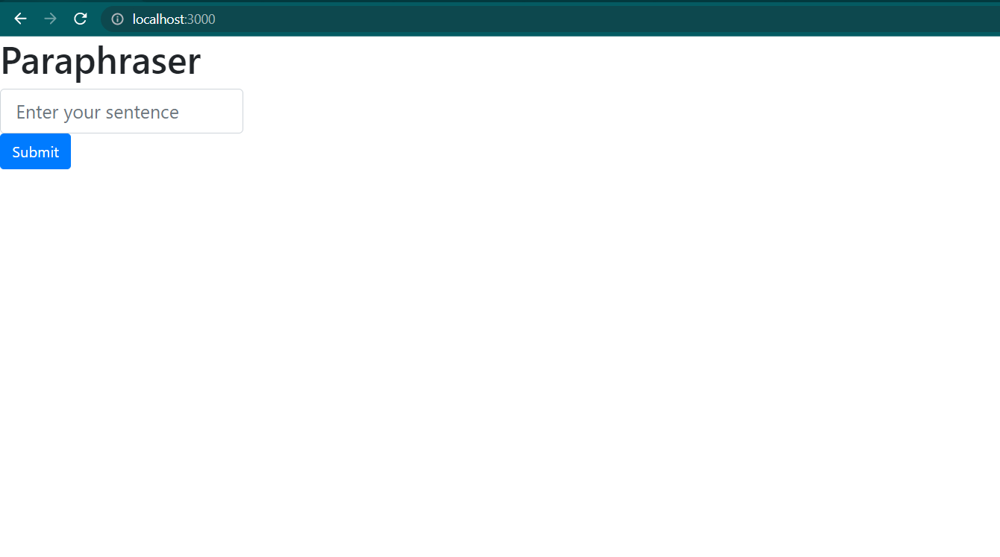

# paraphraser_using_api

This tool rephrases the given sentence using the 
Rewriter/Paraphraser/Text Changer (Multi-Language)
available on Rapid API 

https://rapidapi.com/smodin/api/rewriter-paraphraser-text-changer-multi-language/


## Deployment

To run this project you can either download the zip file or clone it using git cli.

For cloning:

```bash
  gh repo clone tanishque02/paraphraser_using_api
```

1. cd to the directory you cloned this repository in and run
```bash
  npm init --y
```
This is will install all the dependencies required for this project.

2. Run
```bash
  nodemon app.js
```
3. The webapp will get hosted on
```
  localhost:3000
```
Use it accordingly.

##Screenshots




Input String:
```bash
  A paraphrase may attempt to preserve the essential meaning of the material being paraphrased.
```


Result:
```bash
  A summary might endeavor to safeguard the fundamental significance of the material being summarized.
```


API Results:


Quillbot Results:


Snipbot Results:

